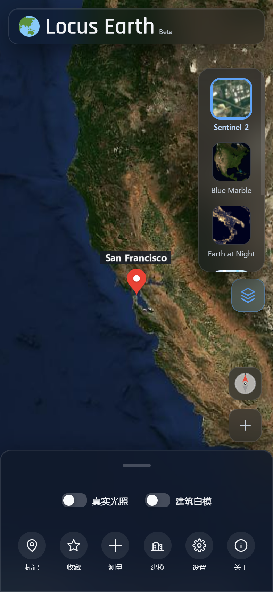
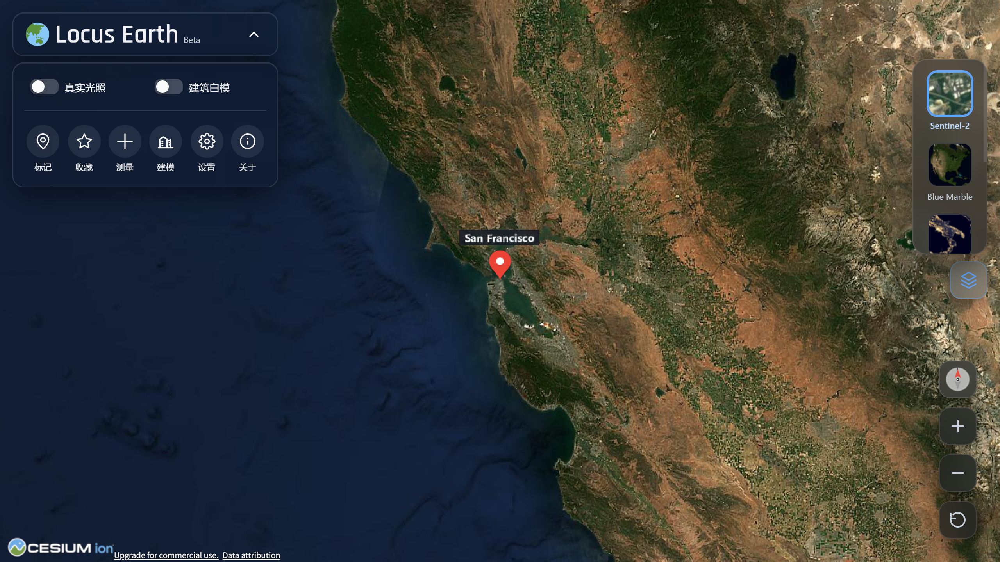

# Locus Earth

🌐 Language / 语言:
<a href="README.md">简体中文</a> | <a>English</a>

> A 3D Earth you can use right in your browser — powered by Cesium, no installation, no registration.
>
> **[GitHub Pages](https://zhunemo.github.io/locus-earth/)** · **[Cloudflare Pages](https://locus-earth.pages.dev)**

---

## Table of Contents
- [Project Introduction](#-project-introduction)
- [Key Features](#-key-features)
- [Interface Preview](#-interface-preview)
- [Usage](#-usage)
- [Settings & Customization](#-settings--customization)
- [Tech Stack & Credits](#-tech-stack--credits)
- [API Key Notes](#-api-key-notes)
- [Project Info](#-project-info)

---

## 🌍 Project Introduction
**Locus Earth** is a lightweight, fast open-source Web 3D Earth application. Inspired by Google Earth, it keeps "open it and see the world" lean and fast: zero build, pure frontend, and installable as a PWA on desktop/mobile.

---

## ✨ Key Features

**Browsing**
- 3D terrain + global satellite imagery, and global 3D buildings (OpenStreetMap).
- One-click switching between multiple base maps: Sentinel-2, Blue Marble, Night Lights, Tianditu Satellite, Tencent Maps, etc.

**Tools**
- Distance / area measurement (both polylines and polygons are clamped to terrain).
- Markers and favorites, stored locally in the browser, with import/export support.
- Place search box; enter a place name to locate it.

**Contextual Integration**
- When entering covered areas such as Denver, Washington D.C., Sydney, etc., high-precision city modeling is automatically enabled.
- When entering mainland China, a "Street View" button automatically appears in the toolbar; click the map to jump to a 360° panorama.

**Appearance & Interaction**
- Realistic lighting, toggle for white building models; light/dark themes (can follow system).
- Compass, reset pitch, draggable floating toolbar; adapted for both desktop and mobile.
- Google 3D Earth mode: one-click switch when the network allows; much lighter than the original.

---

## 📱 Interface Preview
**Mobile:**

**Desktop:**

*Screenshots may not be updated in real time; please visit the website for the latest interface.*

---

## 🧭 Usage
- **Markers / Street View / Measurement are mutually exclusive**: only one can be active at a time; switching automatically closes the other to avoid click conflicts.
- Street View redirection depends on the network and is unavailable when the PWA is offline.
- On mobile, the bottom tray can be expanded by swiping up and collapsed by tapping the handle.

---

## ⚙️ Settings & Customization
Use "Settings" in the toolbar to enter `/settings/`, where you can adjust the light/dark theme (follow system / manual), terrain loading, road network overlay, and cache.

---

## 🚀 Tech Stack & Credits
| | |
|---|---|
| **Engine** | CesiumJS 1.118 |
| **Architecture** | Native ES Modules, zero build step |
| **Type** | PWA (Service Worker + Manifest) |
| **AI Assistance** | DeepSeek, GitHub Copilot, Hunyuan |

**Data Sources**: [Cesium ion](https://ion.cesium.com/) · [OpenStreetMap](https://www.openstreetmap.org/) · [Natural Earth](https://www.naturalearthdata.com/) · [Tianditu](https://www.tianditu.gov.cn/) · [Tencent Maps](https://map.qq.com/)

**Special Thanks**: Tencent Street View uses the community-maintained third-party viewer [qq-map](https://qq-map.netlify.app/) to open panoramas (not an official Tencent service). For coordinate conversion, see [js/coord-transform.js](https://github.com/ZhuNemo/locus-earth/blob/main/js/coord-transform.js) (bidirectional WGS-84 ↔ GCJ-02).

---

## 📝 API Key Notes

<b>Click to view (required reading for forks / self-hosting)</b>

The built-in Cesium, Tencent Maps, and Tianditu keys **all have domain whitelists** and are for this project's demo only.

If you fork or deploy to your own domain / locally, please edit [js/config.js](https://github.com/ZhuNemo/locus-earth/blob/main/js/config.js), replace them with your own free keys, and set your own whitelist in the console. Please do not abuse others' quotas. Thank you for your understanding.

Application Links:
- [Cesium Ion Access Token](https://ion.cesium.com/tokens)
- [Tencent Maps API](https://lbs.qq.com/dev/console/application/mine)
- [Tianditu API](https://cloudcenter.tianditu.gov.cn/center/development/myApp)

---

## 💡 Project Info
| | |
|---|---|
| **Start Date** | 2026-07-04 |
| **Team** | Personal project, developed in spare time, iterated irregularly |
| **Current Version** | 7.2 |

---

© Zhu Nemo · [GitHub](https://github.com/ZhuNemo) · [Dev.to](https://dev.to/zhunemo)
